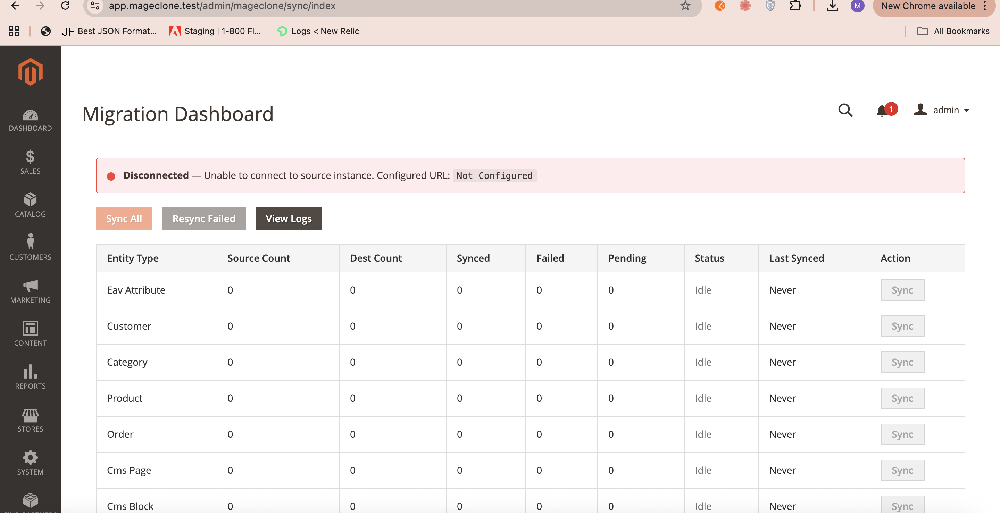
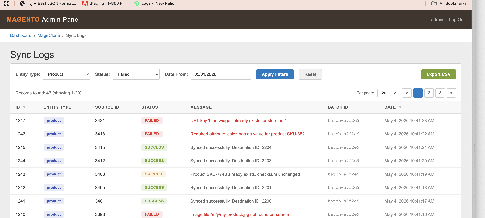
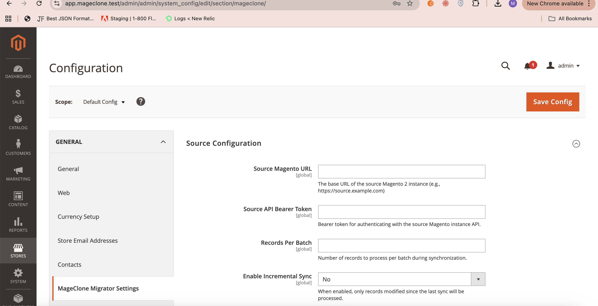

---
tags:
  - magento
  - graphql
  - php
  - migration
  - ecommerce
---

# Building a Magento 2-to-Magento 2 Live Migration Plugin with GraphQL

## The Problem Nobody Had Solved

If you have ever tried to migrate data between two live Magento 2 instances, you know the pain. Maybe you are consolidating two storefronts. Maybe you are standing up a staging environment that needs real data. Maybe a client acquired another business running Magento 2 and needs everything merged. Whatever the reason, you go looking for a tool and quickly realize: nothing really exists for this.

The **Magento Data Migration Tool** only handles Magento 1 to Magento 2. **FireBear ImportExport** is powerful but file-based -- you export CSVs, move them around, and import them, which is clunky for live environments and breaks down with relational data like orders tied to customers. **Cart2Cart** is designed for cross-platform moves and treats Magento as just another cart, missing the depth of its data model entirely. None of these tools are built for the specific scenario of syncing data between two running Magento 2 instances over a network, with full awareness of Magento's entity relationships.

I saw a gap, and I decided to fill it.

## What I Built

**MageClone** is a Composer-installable Magento 2.4.8 module that enables live data migration between two Magento 2 instances using GraphQL. You install it on both the source and destination instances. From there, everything is controlled through the destination's admin panel -- no CLI gymnastics, no manual file transfers, no downtime required.

The goal was simple: make it possible for a store administrator to point their Magento instance at another one and pull over customers, products, categories, CMS content, and orders with a few clicks. The implementation, as it turned out, was anything but simple.

## Architecture: The Pull Model

Early in the design process, I made a decision that shaped everything else: the **pull model**. Instead of having the source instance push data outward, the destination instance reaches out and pulls what it needs. This is safer for several reasons. The source instance does not need any special configuration beyond having the module installed. There is no risk of the source accidentally writing to the wrong place. And the destination -- the instance that owns the migration -- controls the entire flow.

Here is a high-level view of the architecture:

```
+---------------------+          GraphQL API          +----------------------------+
|  SOURCE INSTANCE    | <---------------------------- |   DESTINATION INSTANCE     |
|                     |                               |                            |
|  GraphQL Resolvers  |  ---  query response  --->    |  Sync Engine               |
|  (read-only access) |                               |    |                       |
|                     |                               |    v                       |
+---------------------+                               |  Message Queue             |
                                                      |    |                       |
                                                      |    v                       |
                                                      |  Magento Repositories      |
                                                      |  (save entities locally)   |
                                                      +----------------------------+
```

Three key design decisions drive this architecture:

**Why GraphQL over REST.** Magento's REST API is extensive, but GraphQL gave me exactly what I needed: a typed schema where the client specifies precisely which fields to fetch. When you are pulling a product with its categories, attributes, media gallery, and stock data, a single GraphQL query replaces what would be five or six REST calls. One endpoint, one request, all the data structured exactly the way I need it.

**Why pull over push.** Beyond the safety argument, the pull model means the source instance is entirely passive. It just answers queries. There is no sync configuration on the source side, no credentials to manage there, no scheduled jobs to set up. Install the module, generate an API token, and you are done.

**Why queue-based processing.** Saving a product in Magento is not a cheap operation. There are indexers, cache invalidation, URL rewrites, stock updates. Doing this synchronously for hundreds or thousands of products would time out any HTTP request. By pushing sync operations onto Magento's message queue (backed by either RabbitMQ or MySQL), the system processes entities asynchronously, can retry failures, and does not block the admin interface.

## The ID Mapping Problem

This was the hardest part of the entire project, and it is the reason most people give up on building tools like this.

Two live Magento instances have completely independent auto-increment IDs. Customer #1042 on the source is not the same person as customer #1042 on the destination. You cannot just copy source IDs over -- you would overwrite existing data. And you cannot ignore IDs either, because orders reference customer IDs, products reference category IDs, and everything references attribute IDs.

My solution is the `mageclone_id_mapping` table. It stores a simple but powerful mapping: given an entity type and a source ID, what is the corresponding destination ID?

```
+-------------+-----------+----------------+
| entity_type | source_id | destination_id |
+-------------+-----------+----------------+
| customer    | 1042      | 5731           |
| product     | 88        | 2204           |
| category    | 15        | 43             |
+-------------+-----------+----------------+
```

For initial matching, I use **natural keys** wherever possible. Customers are matched by email address. Products are matched by SKU. CMS pages and blocks are matched by their identifier. This means if the same customer already exists on both instances, the system recognizes them and links the records instead of creating a duplicate.

When saving a new entity, the destination ID is captured and stored in the mapping table. From that point forward, any entity that references the source ID can look up the correct destination ID. An order that belonged to customer #1042 on the source gets correctly assigned to customer #5731 on the destination.

## Entity Sync Engine and Dependency Resolution

You cannot sync entities in arbitrary order. An order references a customer and products. A product references categories and attributes. If you try to sync an order before its customer exists on the destination, you have a broken reference.

I modeled the dependencies as a directed acyclic graph:

```
eav_attributes  (sync first -- everything depends on these)
     |
     +------------------+
     |                  |
  categories        customers
     |                  |
  products           orders
     |
  cms_pages
  cms_blocks
```

A topological sort of this graph produces the correct sync order. The sync engine walks the sorted list, and for each entity type, its dedicated sync class handles the full pipeline: fetch a page of records from the source via GraphQL, map fields to the destination schema, resolve all ID references through the mapping table, save using Magento's repository interfaces, and log the result (success, failure, or skip).

Each sync class follows the same contract but handles the specifics of its entity type. Product sync, for instance, has to deal with media galleries, configurable product links, custom attributes, and stock data. Customer sync handles address books and group assignments. Order sync is the most complex, reconstructing order items, payment information, shipping addresses, and status history.

## GraphQL Schema Design

On the source side, MageClone registers custom GraphQL queries designed specifically for bulk data export. Here is a simplified look at the product query:

```graphql
query {
  magecloneProducts(
    pageSize: 50
    currentPage: 1
    updatedSince: "2025-01-15 00:00:00"
  ) {
    items {
      entity_id
      sku
      name
      type_id
      attribute_set_id
      price
      status
      visibility
      category_ids
      media_gallery {
        image
        label
        position
      }
      extension_attributes {
        stock_item {
          qty
          is_in_stock
        }
      }
    }
    total_count
    page_info {
      current_page
      total_pages
    }
  }
}
```

Two parameters are worth calling out. **Pagination** (`pageSize` and `currentPage`) ensures the system processes data in manageable chunks rather than trying to load every product at once. **Incremental filtering** (`updatedSince`) is what makes ongoing sync possible -- more on that shortly.

The schema uses dedicated types rather than Magento's built-in GraphQL schema because I needed full control over which fields are exposed and how nested data is structured. This also means the source instance does not need to have Magento's native GraphQL schema fully configured.

## Admin Dashboard

One of my goals was to make MageClone accessible to store administrators, not just developers comfortable with a terminal. The admin panel includes a full migration dashboard.


*The MageClone migration dashboard showing real-time sync status across all entity types*

The dashboard displays a **connection status indicator** that shows whether the source instance is reachable and authenticated. Below that, an **entity counts table** shows how many records exist on the source, how many have been synced, and how many are pending or failed. **One-click sync buttons** let administrators trigger a full or incremental sync for any entity type. The page **auto-refreshes every 5 seconds** during active sync operations, so you can watch progress in real time.


*Detailed sync logs with filtering by entity type and status*

A dedicated **log viewer** shows every sync operation with its result, including error messages for failed records. You can filter by entity type and status to quickly find problems.


*Configuration panel for source URL, API token, and sync settings*

The configuration panel lives under Stores > Configuration, following Magento's standard patterns. Source URL, API token, batch size, and cron schedule are all configurable from the admin.

This admin-first approach is what separates MageClone from a script you run once and throw away. It is a tool that a team can use on an ongoing basis.

## Incremental Sync

The initial full sync is only half the story. In a live environment, data changes constantly. New customers register, orders come in, products get updated. MageClone handles this through incremental sync.

Every sync operation records a `last_synced_at` timestamp in the `mageclone_sync_status` table. On subsequent runs, the system passes this timestamp as the `updatedSince` parameter to the source GraphQL queries, which filter records by their `updated_at` column. Only records that have changed since the last sync are fetched and processed.

A cron job runs every 4 hours by default, performing an incremental sync across all entity types. If any records fail during a sync run, they are flagged in the sync log and can be retried with a single click from the dashboard. This combination of scheduled incremental sync and manual retry covers both the steady-state and error-recovery workflows.

## Tech Stack

A quick summary of what MageClone is built with:

- **Magento 2.4.8** with **PHP 8.1+**
- **GraphQL** for all API communication between instances
- **Magento Message Queue** (supports both RabbitMQ and MySQL backends) for async entity processing
- **3 custom database tables**: `mageclone_id_mapping`, `mageclone_sync_status`, and `mageclone_sync_log`
- **12 unit tests** covering ID mapping, dependency resolution, and field transformation
- Approximately **100 files** and **15,000 lines of code**

## What I Learned

Building MageClone reinforced several things I had an intuition about and taught me a few things I did not expect.

**ID mapping is the core of any migration tool.** I knew it would be important, but I underestimated how much of the codebase would end up touching the mapping table. Nearly every entity sync class spends more logic resolving ID references than it does on the actual data transformation. If I were starting over, I would design the mapping layer first and build everything else around it.

**GraphQL is exceptionally well-suited for structured data transfer.** The ability to define exactly what fields you need, nest related data, and get it all in a single typed response made the fetch side of the pipeline clean and predictable. REST would have worked, but the code would have been messier and slower.

**Queue-based processing is not optional for this kind of work.** Early prototypes tried to save entities synchronously, and they fell apart at scale. Magento's entity save operations trigger too many side effects. The queue makes the system resilient -- if a consumer crashes, the message stays in the queue and gets retried.

**Dependency ordering matters more than you think.** I spent time getting the topological sort right, and it paid off. Every time I added a new entity type, the dependency graph ensured it slotted into the correct position automatically. Without that foundation, adding order sync would have been a nightmare of manual sequencing.

## What's Next

MageClone handles the core entity types, but Magento's data model is vast. Future improvements I am planning:

- **More entity types**: reviews, wishlists, search synonyms, URL rewrites
- **Webhook-based real-time sync**: instead of polling every 4 hours, react to changes instantly
- **Multi-store mapping**: support mapping source store views to different destination store views
- **Performance benchmarks**: formal testing with large catalogs (10k+ products, 100k+ customers)
- **Integration tests**: end-to-end tests with two actual Magento instances via Docker

I built MageClone because I needed it to exist. The Magento ecosystem has matured tremendously, but live instance-to-instance migration remained a gap. I hope this module is useful to others facing the same challenge.

## Links

- **GitLab Repository**: [https://github.com/manali222/MagentoMigration](https://github.com/manali222/MagentoMigration)
